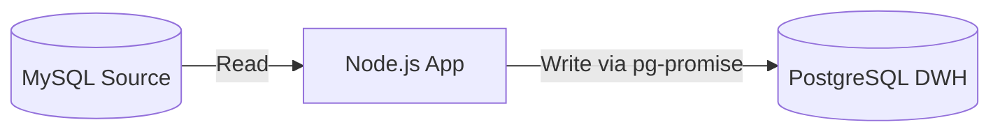

# Aturan & Spesifikasi Proyek (pos-to-datawarehouse)

Dokumen ini mendefinisikan aturan main, arsitektur, dan spesifikasi teknologi yang digunakan dalam proyek ini. Semua pengembangan kode harus mematuhi aturan berikut.

---

## 1. Lingkungan & Standar Kode
- **Runtime:** Node.js.
- **Modul:** Menggunakan **ES6 Modules** (`import`/`export`). Proyek dikonfigurasi dengan `"type": "module"` pada `package.json`.
- **Gaya Kode:** Bersih, asinkronus menggunakan `async`/`await`, dan penanganan error yang baik (try-catch block pada setiap proses eksternal).

---

## 2. Koneksi & Aliran Data Database
Proyek ini menghubungkan dua jenis basis data dengan aliran data satu arah:
1. **Source Database (MySQL):** 
   - Digunakan untuk membaca/mengambil data transaksi (POS Cloud).
   - Gunakan driver MySQL yang sesuai (seperti `mysql2/promise`).
2. **Destination Database (PostgreSQL):**
   - Digunakan untuk menulis/menyimpan hasil sinkronisasi data ke Data Warehouse.
   - **Wajib menggunakan pustaka [pg-promise](https://github.com/vitaly-t/pg-promise)** untuk query dan transaksi ke PostgreSQL.



---

## 3. Layanan HTTP & Integrasi POST
- Aplikasi harus membuka port server HTTP untuk menerima perintah manual secara dinamis.
- **Port Default:** `3900` (wajib dikonfigurasi via environment variable, misalnya `PORT` atau `HTTP_PORT`).
- **Endpoint:** Menerima perintah/trigger sinkronisasi secara manual melalui request metode **POST**.

---

## 4. Penjadwalan Otomatis (Cron Job)
- Selain via HTTP POST, aplikasi harus dapat berjalan secara berkala secara otomatis.
- **Default Schedule:** Setiap 5 menit sekali (`*/5 * * * *`).
- **Konfigurasi:** Jadwal cron ini harus dapat dikonfigurasi melalui environment variable (misalnya `CRON_SCHEDULE`).

---

## 5. Struktur Environment Variables (`.env`)
Pastikan variabel lingkungan berikut didefinisikan pada file `.env` di root direktori:

```ini
# HTTP Server Configuration
PORT=3900

# Cron Configuration
CRON_SCHEDULE="*/5 * * * *"

# MySQL Source Database Configuration
MYSQL_HOST=localhost
MYSQL_PORT=3306
MYSQL_USER=root
MYSQL_PASSWORD=
MYSQL_DATABASE=pos_db

# PostgreSQL Target Database Configuration
PG_HOST=localhost
PG_PORT=5432
PG_USER=postgres
PG_PASSWORD=secret
PG_DATABASE=datawarehouse
```
